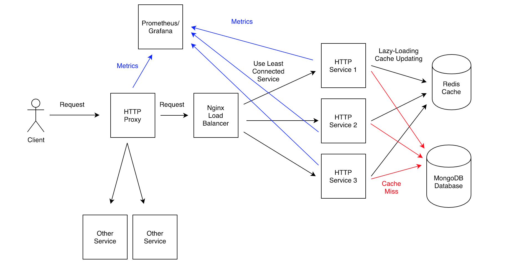

# Listing-Details-Sidebar

## Description

The goal of this project was to [inherit a microservice component from a collegue](https://github.com/Team-Elysium/listing-details) with a basic backend and scale it to production levels capable of handling thousands of requests per second. The scope of my work is exclusive to the backend including the:

- Server: [HTTP](https://nodejs.org/api/http.html)
- Proxy: [HTTP](https://nodejs.org/api/http.html)
- Database: [MongoDB](https://www.mongodb.com/)
- Remote-Cache: [Redis](https://redis.io/)
- Remote-Monitoring-Service: [Prometheus](https://prometheus.io/)/[Grafana](https://grafana.com/)
- Load-Balancer: [Nginx](https://www.nginx.com/)
- Deployment: [Docker](https://www.docker.com/)/[AWS-EC2-t2.micro](https://aws.amazon.com/ec2/instance-types/t2/)

**PLEASE NOTE**: This README will be devoted to explaining the system design choices and consideration in total rather than containing instructions on how to deploy this service. The reason for this is this repo was part of a learning process and is a cog in a much larger system which, in my opinion, offers much more interesting insights than just this repo itself.

## Table of Contents

- [notes-on-load-testing](#notes-on-load-testing)
- [proxy](#proxy)
- [server](#server)
- [database](#database)
- [caching](#caching)
- [monitoring](#monitoring)
- [load-balancing](#load-balancing)
- [deployment](#deployment)

## Notes On Load Testing

There are a few considerations to make when load testing and optimizing which are:

**Test Early** and test often. Being able to view incremental gains as a project develops can be crucial to performing endgame optimizations.

**Choose a Consistent Strategy** so that the tests are repeatable. You need all things to be equal between the tests to accuratly measure and compare performance. Identifying what and how to test will make a big difference in the long run.

**Length of the Test** is an important consideration to make. It's possible that the time you choose ends just momemnts before your server reaches its limits. To choose an appropriate length, you should test out multiple variations and see when the server has stabilized.

**Other Instance Processes** should be taking into account as well. The server managing a heavy load will use more and more resources. If another process is running on the computer it might reach its limit earlier than intended.

**Proper Analysis of Failures** is another critical consideration when stress testing. Once we begin to see hicups in performance, it is important we are able to explain them. If we can't then breakdowns further down the road might also be unexplainable.

**Everything Is Temporary**, meaning that tests today might not have the same results as the tests we perform tomorrow, one week, or even one month from now.

Sources:

- [Four-Load-Testing-Mistakes...](https://engineering.klarna.com/four-load-testing-mistakes-developers-love-to-make-68b443f7e8a2)
- [Five-Performance-Testing-Considerations...](https://rraheja.wordpress.com/2011/02/08/5-performance-testing-considerations-for-application-integrations/)
- [Ultimate-Guide-Performance-Testing...](https://stackify.com/ultimate-guide-performance-testing-and-software-testing/)

## Server & Proxy

**Express** was implemented in the inherited code base as the framework of choice. Express offers a lot of conveniences such as simplifying a server's code base as well as exposing a lot of tooling that would otherwise be quite complex.

**HTTP** is a "baked into" Node as a module. This module is notably fast compared to frameworks, which makes sense since frameworks sit ontop of HTTP. The drawback of using HTTP is having to explicitly handling all cases. If implemented correctly though, an HTTP server is capable of [handling more requests per second](https://raygun.com/blog/nodejs-vs-hapi-express-restify-koa/).

**For this project** the server and proxy were refactored to use raw HTTP for the performance boost. Nither one was too complex and we have a very limited amount of endpoint to handle.

## Database

Choosing a database for the project was done through a process of elimination.

**Data Structures** plays a key role in choosing a database. It will be what determines whether we will use a relational database or a document database (SQL vs noSQL).

**Scalability** is something one needs to think about for long-term planning. While the database is _usually_ not the bottleneck when beginning to scale, it will inevitably face problems. Having easy, built in solutions to these problems plays a substantial role in the decision process.

**For This Project**, data structure and scalability led me to my decision. I inherited a data structure that was already defined to fit the front end. I did not have to think about the format of the data structure but rather which database it would fit best in. Because it was a single object per datapoint, a _document database_ would suffice.

These days a lot of databases are starting to blur the lines between what kind of database they actually are (see [postgreSQL](https://www.postgresql.org/docs/9.5/functions-json.html) or [MongoDB](https://docs.mongodb.com/manual/tutorial/model-referenced-one-to-many-relationships-between-documents/)). With that being said, I will assume that traditional relational databases are better for relational data, and document database are better for document data.

**MongoDB** was chosen for a few basic reasons. This project has extremely basic requirements in terms a querying. Each client only needs to be able to read documents (as apposed to writing or updating records). Outside of that the only other consideration needed is how easy it is to scale. MongoDB utilizes a simple query language through JavaScript and also provides [horizontal scaling opportunities](https://docs.mongodb.com/manual/sharding/) that should fullfill any forseeable future requirements.

## Caching

[**Redis**](https://redis.io/) is a popular tool when implementing caching. When considering caching there are two main strategies to consider, _lazy-loading_ and _write through_. For this section I explain my reasoning behind the choice I make.

Skip to:

- [Approaches](#approaches)
- [Timing](#timing)
- [Evictions](#evictions)

### APPROACHES

**Lazy-Loading** is checking the cache and, on a miss, retrieving the data from the database, writing to the cache, and finally responding with the data. This method can be beneficial as we only store things that are actively being looked up. This can be a problem with very random and relatively low demand data points being stored too often. It's also possible that we return incorrect data if something has been changed/updated since it was last stored in the cache.

**Write Through** is proactively updating the cache when we update the database so the cache is always up to date. This can keep our cache always returning the correct data but we again run into the problem of storing data points that might be low in demand and missing some high demand data points.

**For this project** simple _lazy-loading_ is utilized for this project. The application does not have any write-to-database features but if it did, we would need to communicate with the other microservices to be updated with the information.

Overall a combination of the two is preferable. _Lazy-loading_ to keep high demand data in store as well as _write through_ to keep it up to date. Another important consideration to make during configuration is time until expiration.

### TIMING

**Timing** is a critical. Not only will an appropriate _time to expiration_ affect the server response time it can also determine the loads the database experiences at any given point.

Coming up with appropriate times is a subjective decision that one has to make. Considerations that would go into this is the traffic that the website experiences as well as volume of cached data we need to store.

Something to consider as well is how much _data expires at the same time_. If the server experiences an unusually low load for a period of time and all data expires during that time, our database and server will be strained when the load is normalized. Because of this we need to have not only a set time but also a _random amount of time added on_. This would provide potential wiggle room in expiration times and hopefully help satisfy low load to high load occurrences.

**For this project** I want high demand areas to be cached. One hundred random listings were chosen as the “top apartments”. As stated before, the project only uses _lazy-loading_, meaning anytime we miss a lookup we will cache the item after the it is retrieved from the database. One thing to differentiate the top one hundred is the amount of time until expiration. These will be stored for 5 minutes whereas everything else will be kept for 1 minute.

Additionally we will add a _jitter_ of a random amount of time from 0 to the set expiration time. At most we will double the time in the cache and at least we will add nothing.

### EVICTIONS

**Evictions** occur when the cache has run out of usable memory. It must decide on how to handle the data meant to be stored and the data already stored. There are a few options to choose from for Redis:

- **noeviction**: return errors when the memory limit was reached and the client is trying to execute commands that could result in more memory to be used (most write commands, but DEL and a few more exceptions).
- **allkeys-lru**: evict keys by trying to remove the less recently used (LRU) keys first, in order to make space for the new data added.
- **volatile-lru**: evict keys by trying to remove the less recently used (LRU) keys first, but only among keys that have an expire set, in order to make space for the new data added.
- **allkeys-random**: evict keys randomly in order to make space for the new data added.
- **volatile-random**: evict keys randomly in order to make space for the new data added, but only evict keys with an expire set.
- **volatile-ttl**: evict keys with an expire set, and try to evict keys with a shorter time to live (TTL) first, in order to make space for the new data added.

  Source: https://redis.io/topics/lru-cache

**For this project** _allkeys-lru_ is chosen as I have already determined that the [law of power](https://en.wikipedia.org/wiki/Power_law) will exist for this website and it will have top listings. There will be popular pages that get accessed more often than others. Another note is that we have set the max memory setting to 1gb. Our Redis cache has a dedicated computer behind it so we can use a substantial amount of the computer's memory (in this case 100% of [AWS EC2 t2 micro instance](https://aws.amazon.com/ec2/instance-types/)).

## Monitoring

**Monitoring** is an important part of any system. Without monitoring we could only ever be reactionary to problems instead of detecting them early and acting _before_ it manifests into something larger.

[**Prometheus**](https://prometheus.io/) is an open source monitoring tool. With it, one can get regularly updated with the servers health and performance. Prometheus itself is a seperate server that will "reach out" and hit an endpoint that is defined on the desired server. The server will then use _prom-client_ to serve up the data, to Prometheus.

[**Prom-client**](https://github.com/siimon/prom-client) is used to interact with the Node server to collects data and ship it to Prometheus when it is triggered (when Prometheus hits the correct endpoint that we define). This module lets one monitor as much and as often as they want to.

[**Grafana**](https://grafana.com/) is a 3rd party graphing tool that will take the Prometheus metrics and make them look pretty. The reason for this tool is Prometheus, while it does have graphing capabilitiesm, are not nearly as customizable. It is a great visualization tool to use in combination with Prometheus and works with many other metric collecting technologies as well.

**Metrics** is the term used for the datapoints we are collecting from a process. With these open source tools we can collect as many as we want. Some basic ones are:

- **Success Rates**: The amount of requests you respond to successfully over the total number of requests.
- **Error Rates**: How many times you return an error when responding to a request over the total requests.
- **Invalid Rates**: How many times an invalid request is sent to your server over the total number of requests.
- **Latency**: How long is it taking you to respond to requests.
- **Database Time**: How long its taking for your server to get the data from your database.

With these simple metrics one can determine a baseline for the health of their server.

**For this project**, all of the above was implemented. Prometheus is a very powerful tool that, with little configuration, can help debug and open up bottlenecks specific to the server.

## Load-Balancing

**Load Balancing** is the managment of requests across multiple instances of the same service. The idea behind load balancing is to horizontally optimize the total load the service can handle. If a single service can only handle 1000 requests per second then it stands to reason 3 instances can handle 3 times as many. This was implemented to "open up" the bottleneck that was the single service.

[**Nginx**](https://www.nginx.com/) is a web server that can be used as many different tools. The webside touts many different benefits but I will use it as a reverse proxy. The main consideration for load balancing is how we determine which instance we choose to route the request to know as _scheduling_.

### Scheduling

**Round Robin** is when the load balancer makes a list of available services. When it recieves a request it sends it to the first in the list. For all subsequent requests, it moves to the next service on the list. When it reaches the end of the list it resets to the beginning.

**Least Connections** is a technique that monitors how many connections are open with a specific service. It then chooses the service with the least amount of outstanding connections.

**Least Time** is when the load balancer keeps track of the average response time from each of the services. It then prioritizes the services that responds the quickest.

**For this project** _least connections_ _scheduling_ was chosen. This technique showed the most performant in many of my tests and also showed the least amount of load on any individual service at a given time.

## Deployment

There are a few services that will provide a remote machine for free today. I chose to go with [Amazon Web Services](https://aws.amazon.com/), specifically an AWS [EC2 t2.micro](https://aws.amazon.com/ec2/instance-types/t2/) instance. A basic AWS account is able to run these for free up to 750 hours a month.

Some important considerations when running these instances is:

- [**Hour Accumulation**](https://aws.amazon.com/ec2/pricing/): You get 750 hours for free across all servers. Multiple servers accrue concurrently meaning a single hour with two instances running will count as two hours used.
- [**CPU Burst Performance**](https://aws.amazon.com/ec2/instance-types/#burst): The t2.micro computers dont have a lot of CPU power. To make up for this Amazon offers CPU credits where the server will overclock at times of high demand on the CPU. One minute running at this overclocked pace will use up a CPU token. Once all your CPU tokens are used up Amazon _might_ be [throttling your CPU capabilities](https://docs.aws.amazon.com/AWSEC2/latest/UserGuide/burstable-credits-baseline-concepts.html).
- [**Computer Specifications**](https://aws.amazon.com/ec2/instance-types/): Knowing the processes you will need to run and what requirment they will have of a machine can be useful when deploying. The t2.micro had enough specifications to _run_ everything I needed.
- **Configuration**: The default setting on these computers are not configured for high volume loads. Seeing as we are attempting to scale a service for large amount of traffic we need to play with the configuration so they dont get bogged down. The major culprits are the connection tables for the kernal. Much of this will become apparent by checking system logs during stress tests.
